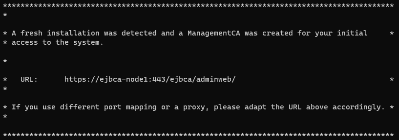
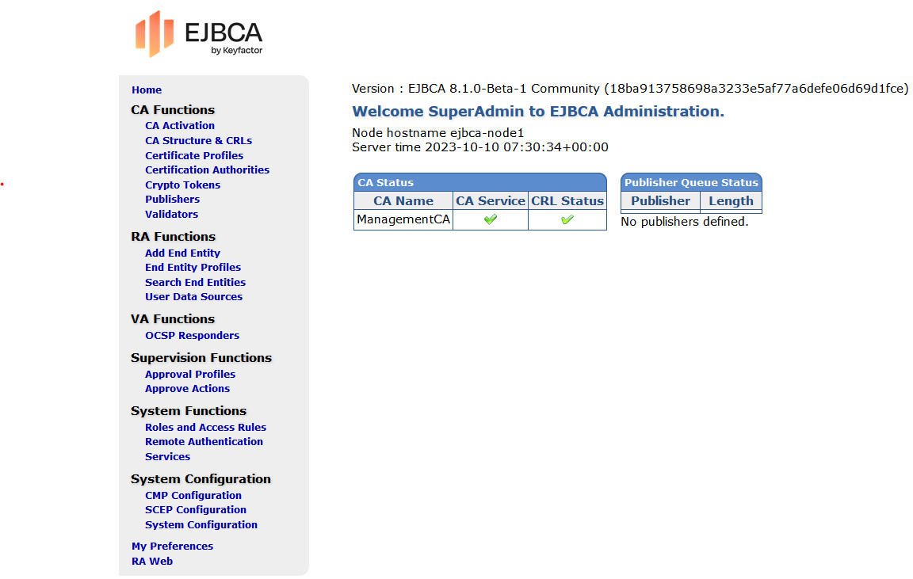

# Setting up a EJBCA Docker container

Setting up the EJBCA container was an incredibly smooth experience, largely thanks to the comprehensive and user-friendly [documentation](https://doc.primekey.com/ejbca/tutorials-and-guides/tutorial-start-out-with-ejbca-docker-container#TutorialStartoutwithEJBCADockercontainer-AddEndEntity) provided. Every step had clear instructions.

1. Create directory

   - Create a directory for running the container and storing the database

     ```cli
     $ mkdir -p containers/datadbdir
     $ cd containers
     ```

1. Create Docker Compose file

   - Create docker-compose.yml file and add following content

     ```cli
     $ vim docker-compose.yml
     ```

     ```yml
     version: '3'
        networks:
        access-bridge:
            driver: bridge
        application-bridge:
            driver: bridge
        services:
        ejbca-database:
            container_name: ejbca-database
            image: "library/mariadb:latest"
            networks:
            - application-bridge
            environment:
            - MYSQL_ROOT_PASSWORD=foo123
            - MYSQL_DATABASE=ejbca
            - MYSQL_USER=ejbca
            - MYSQL_PASSWORD=ejbca
            volumes:
            - ./datadbdir:/var/lib/mysql:rw
        ejbca-node1:
            hostname: ejbca-node1
            container_name: ejbca
            image: keyfactor/ejbca-ce:latest
            depends_on:
            - ejbca-database
            networks:
            - access-bridge
            - application-bridge
            environment:
            - DATABASE_JDBC_URL=jdbc:mariadb://ejbca-database:3306/ejbca?characterEncoding=UTF-8
            - LOG_LEVEL_APP=INFO
            - LOG_LEVEL_SERVER=INFO
            - TLS_SETUP_ENABLED=simple
            ports:
            - "80:8080"
            - "443:8443"
     ```

1. Start EJBCA Community container

   ```cli
   $ docker-compose up -d
   ```

1. Check log output of the container starting up

   ```cli
   $ docker compose logs -f
   ```

1. The output of the logs provide the URL to access the EJBCA web interface

   

1. Use this URL in your browser (_preferably Firefox_) to access the web interface

   - Note: when using a different machine to access the web interface use the following URL `https://[ip-hosting-ejbca]:443/ejbca/adminweb/`

1. In the browser accept the security risk by clicking **Advanced** and then **Accept the risk and continue**

   

1. Issue SuperAdmin certificate

   1. In EJBCA, click RA Web to access the EJBCA RA UI.
   1. Under Request new certificate, select Make New Request.
   1. Update the following information:
      - For Select Request Template Certificate subtype, select ENDUSER (default).
      - For Key-pair generation, select By the CA.
      - For Key algorithm, select RSA 2048 bits.
      - For the Required Subject DN Attributes Common Name, specify SuperAdmin.
      - Under Other Data, clear Key Recoverable.
      - For Provide User Credentials, specify Username "superadmin" and password "foo123" to save this in the EJBCA database under the user name superadmin.
   1. Last, click Download the PKCS#12 to download the certificate.
   1. Your certificate is saved as a SuperAdmin.p12 file.

1. Import certificate into browser

1. Access EJBCA as Administrator

   1. In the EJBCA menu, click Roles and Access Rules.
   1. In the list of available roles, next to Public Access Role, click Delete and verify the deletion of the role.
      The Roles Management page now lists the Super Administrator Role.
   1. Next to the Super Administrator Role, click Members.
   1. Specify the following for the admin role:
      - Match with: Select X509:CN, Common name.
      - CA: Select Management CA for the CA to match on.
      - Match Value: The CN value from the created certificate: "SuperAdmin". Note that this is a case-sensitive matching.
   1. Click Add to add the user to the Super Administrator Role.

1. Restart EJBCA

   ```cli
   $ docker compose restart -d
   ```

1. Refresh the dashboard page in your browser, when prompted for the SuperAdmin certificate, ensure that the correct certificate is selected.

1. Restrict Access to EJBCA
   1. In the EJBCA menu, click Roles and Access Rules.
   1. In the list of available roles, next to Public Access Role, click Delete and verify the deletion of the role.
      The Roles Management page now lists the Super Administrator Role.
   1. Next to the Super Administrator Role, click Members.
   1. In the list of available members, for the PublicAccessAuthenticationToken, click Delete and verify the deletion of the role member.
