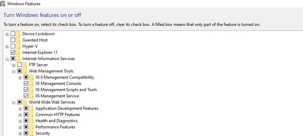
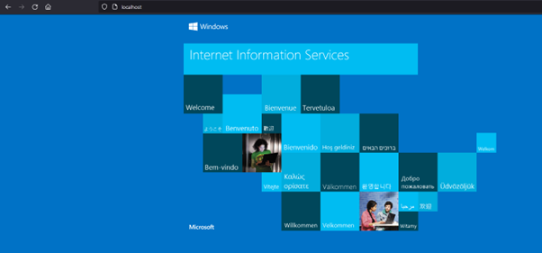
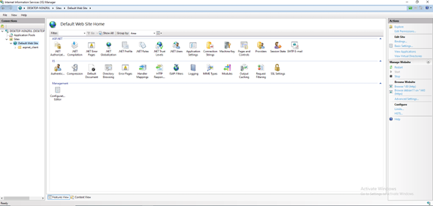
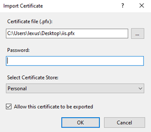
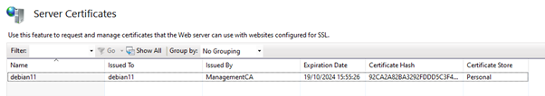
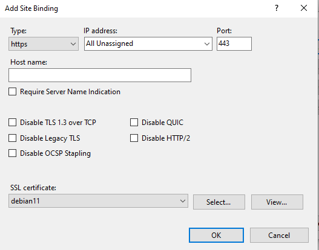
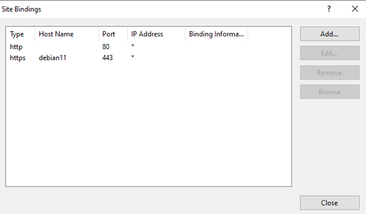
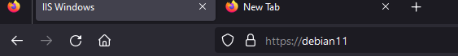
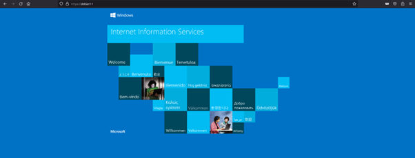

# Setting up microsoft IIS with SSL/TLS

**Installing Microsoft IIS:**

You can install Microsoft IIS on any Windows operating system. To install it, open the "Control Panel," then go to "Programs" and select "Turn Windows features on or off." Now, locate and select "Internet Information Services." Make sure to select all the necessary components under "Web Management Tools" and "World Wide Web Services."

**Check the correct installation of Microsoft IIS:**

To check the correct installation of Microsoft IIS, open your favorite web browser and type "localhost" into the address bar. If the installation is done correctly, you should see the default website.

As you can see, SSL/TLS is not currently enabled. In the following steps, we will provide a detailed guide on how to enable SSL/TLS.

**Setting up SSL/TLS:**

To set up SSL/TLS, you'll need a server certificate in .pfx format, which typically contains an SSL certificate and its corresponding private keys. In our case, we had separate .pem and .key files, which we combined into one .pfx file using a tool like OpenSSL.

If you're using your own Public Key Infrastructure (PKI), make sure to import the root CA certificate into your web browser.
For more information on setting up your own Public Key Infrastructure (PKI) with EJBCA, please refer to our documentation.

To access the Internet Information Services Manager, open the Windows search bar and type "Internet Information Services Manager." Once the app is open, you'll have access to various settings and management options for your IIS web server.

To import the SSL/TLS certificate, follow these steps:
1.	Double-click "Server Certificates."
2.	In the right-hand menu, select "Import."
3.	Choose the appropriate .pfx file and enter the correct password.
4.	Leave all other settings at their default values.
5.	Click "OK."

If everything is done correctly, you should see the details of your imported SSL/TLS certificate.

 1. On the left-hand menu, expand all your resources, and then right-click on your website. In our case, it's the "Default Web Site." Click "Edit Bindings" and then select "Add…"
 2. Choose "https" as the binding type and enter the host name. Ensure that the host name matches the Common Name on your SSL certificate
 3. Select the appropriate SSL certificate from the list.
 4. Leave all other settings at their default values and click "OK."

If done correctly, you should see a result or interface that resembles this.

You can close this window now.

**Testing the SSL/TLS of our website.**

Connect to your website using 'https://' and the correct domain name. If necessary, modify the hosts file.
If you have followed the documentation correctly, you should observe that the website establishes a secure connection.

